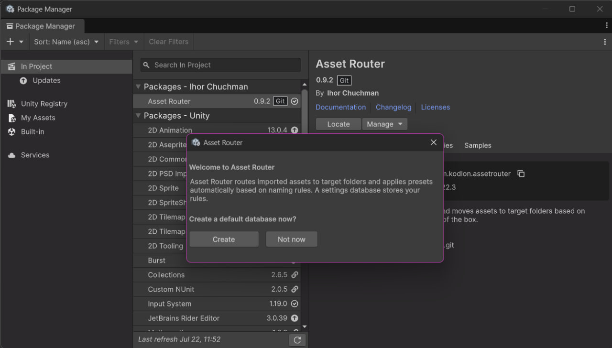
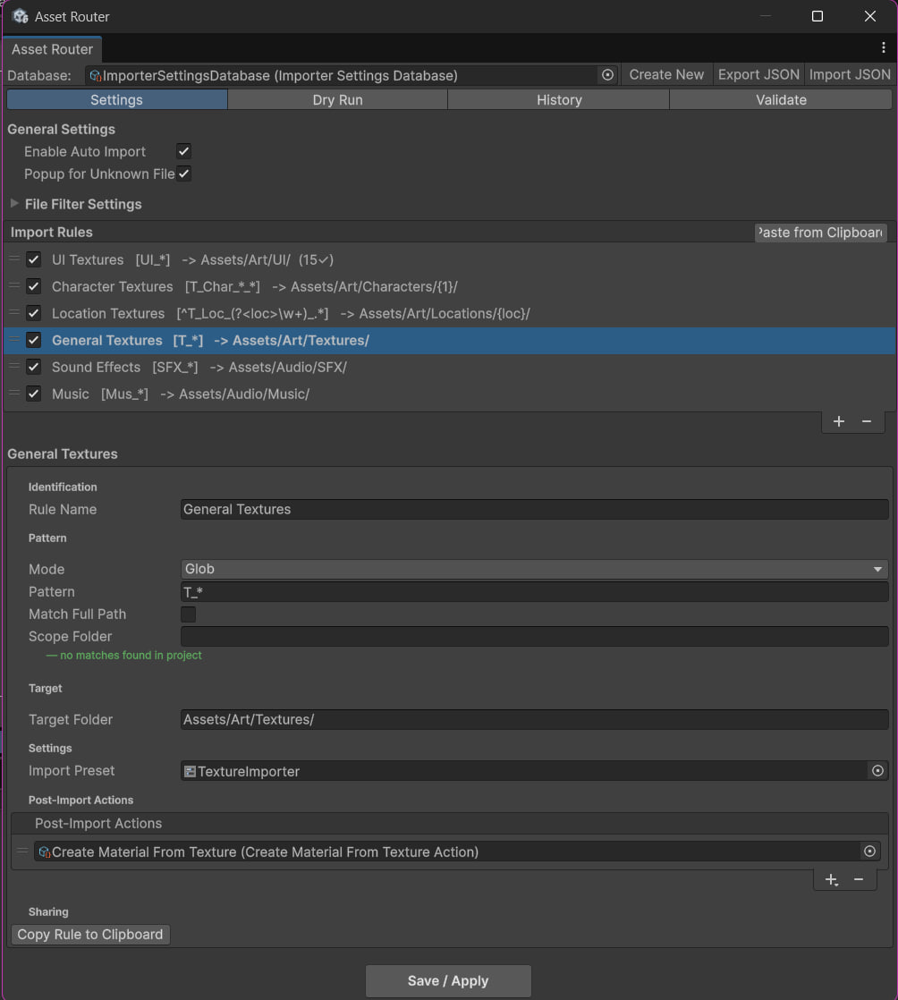
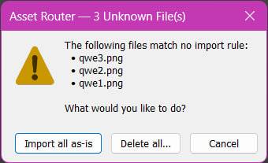

# Getting Started

This guide takes you from an empty project to your first automated import in about ten minutes.
No editor scripting experience is needed.

Asset Router watches files as you add them to the project. When a file name matches a rule,
the plugin applies import settings and moves the file to the right folder. You set up the rules
once. After that, every import lands where it should.

## What you need

- Unity 2022.3 LTS or newer.
- Any picture file and any short audio file on your disk, for the test drops in steps 4 to 7.

---

## Step 1. Install the package

1. Open **Window > Package Manager**.
2. Click **+** in the top-left corner and choose **Add package from git URL**.
3. Paste `https://github.com/kodlon/AssetRouter.git` and click **Add**.

Unity downloads and compiles the package. When it finishes, a new menu appears under
**Tools > Asset Router**.

---

## Step 2. Create the settings database

Right after installation Asset Router shows a small welcome dialog asking to create a default
database.



Click **Create**. Two things happen:

- The file `Assets/AssetRouter/ImporterSettingsDatabase.asset` appears in your project. This
  database stores all your rules and settings. Commit it to version control like any other asset.
- The main Asset Router window opens, already filled with six starter rules.

If you clicked **Not now** or missed the dialog, open **Tools > Asset Router > Settings** and
click **Create New Database** instead. The result is the same.



---

## Step 3. Read the rules list

The middle of the window shows the starter rules. Each row has a checkbox (rule on or off), the
rule name, the pattern in brackets, and the target folder after the arrow.

| Rule | Pattern | Files go to |
|------|---------|-------------|
| UI Textures | `UI_*` | `Assets/Art/UI/` |
| Character Textures | `T_Char_*_*` | `Assets/Art/Characters/{1}/` |
| Location Textures | `^T_Loc_(?<loc>\w+)_.*` | `Assets/Art/Locations/{loc}/` |
| General Textures | `T_*` | `Assets/Art/Textures/` |
| Sound Effects | `SFX_*` | `Assets/Audio/SFX/` |
| Music | `Mus_*` | `Assets/Audio/Music/` |

On every import Asset Router walks this list top to bottom and applies the first rule whose
pattern matches the file name. `*` in a pattern means "any characters". Drag rows to change
priority: put specific rules above general ones.

### Glob and Regex: two pattern styles

The **Mode** field on each rule picks one of two pattern styles.

**Glob** is the simple one. Write the file name and put `*` where anything can appear:
`T_*` means "starts with `T_`", `*_D.png` means "ends with `_D.png`". `?` stands for exactly
one character. Five of the six starter rules use Glob, and it covers most everyday naming
conventions.

**Regex** (regular expressions) is the powerful one. Switch to it when Glob cannot express what
you need: "letters and digits only", alternatives like "`.png` or `.tga`", or a captured value
with a readable name (next section). The price is that the pattern gets harder to read.

Start every rule as Glob. Move to Regex only when `*` and `?` are not enough.

### Reading the scary one

The Location Textures rule uses Regex: `^T_Loc_(?<loc>\w+)_.*`. It looks cryptic, but it is
just five pieces in a row:

| Piece | Meaning |
|-------|---------|
| `^` | The name must start here, no characters before |
| `T_Loc_` | These exact characters |
| `(?<loc>\w+)` | One or more letters, digits, or underscores, saved into a group named `loc` |
| `_` | An underscore |
| `.*` | Anything up to the end |

Drop `T_Loc_Forest_Rock.png` and the pattern matches, with the word `Forest` saved into `loc`.
The rule's target folder `Assets/Art/Locations/{loc}/` picks that value up, so the file lands in
`Assets/Art/Locations/Forest/`. One rule sorts every location into its own subfolder, including
locations that do not exist yet.

Glob captures too, just without names: each `*` becomes a numbered group. That is how the
Character Textures rule routes `T_Char_Hero_D.png` to `Assets/Art/Characters/Hero/` with `{1}`.

You do not need to write regex from memory. Copy an existing rule, change the literal parts
(`T_Loc_` to your prefix), and watch the live preview under the Pattern field (step 7 shows
where it is). Red text means the pattern is invalid; wrong files in the preview mean the pattern
is too broad or too narrow. Adjust and check again.

Ready-made patterns for common tasks, in both styles, live in the
[Pattern Cookbook](patterns.md), together with the usual mistakes and how to test a pattern
before trusting it.

---

## Step 4. Drop your first file

1. Take any picture on your disk and rename it to `T_Rock_D.png`.
2. Drag it into the root of the Project window (`Assets/`).

The file does not stay in the root. The "General Textures" rule (`T_*`) matches its name, so
Asset Router applies the `TextureImporter` preset and moves the file to
`Assets/Art/Textures/T_Rock_D.png`. The Console confirms it:

```
[AssetRouter] Moved: Assets/T_Rock_D.png -> Assets/Art/Textures/T_Rock_D.png (General Textures)
```

That is the whole workflow. Name the file by convention, drop it anywhere, and it lands in the
right place with the right import settings.

---

## Step 5. See a post-import action in play

Rules can do more than move files. Click the **General Textures** rule in the list and scroll down
to the **Post-Import Actions** section in the rule details. It contains one entry: **Create Material
From Texture**. This action creates a ready-to-use material for every texture matched by the rule,
so you never have to right-click → Create → Material for a fresh diffuse texture again.

Test it. Rename a picture to `T_Rock_D.png` (if you skipped Step 4) and drop it into the project.
It moves to `Assets/Art/Textures/`, and a matching `T_Rock_D_Mat.mat` appears in
`Assets/Art/Textures/Materials/` with the texture already assigned to the shader's main slot.

This is how any action attaches to any rule: select the rule, click **+** under
**Post-Import Actions**, and pick an action type from the menu. The package ships with eleven
built-in actions, from trimming silence in WAV files to generating prefabs. See the
[Built-in Actions Reference](actions/README.md).

---

## Step 6. Import a file that matches nothing

Rename a picture to `photo.png` and drop it in. No rule matches that name, so Asset Router shows
a dialog listing the file and asking what to do.



- **Import all as-is** keeps the file where you dropped it.
- **Cancel** also keeps the file, without logging anything.
- **Delete all…** removes the listed files after a second confirmation.

This popup is a safety net against files that slip past your naming convention. If you find it
noisy, turn it off in the **Settings** tab under **General Settings > Popup for Unknown Files**.

---

## Step 7. Create your own first rule

The starter rules know nothing about voice-over files. Add a rule for them:

1. Click **+** at the bottom of the **Import Rules** list. A rule named "New Rule" appears and
   its details open below the list.
2. Fill the fields:

   | Field | Value |
   |-------|-------|
   | Rule Name | `Voice` |
   | Mode | Glob |
   | Pattern | `Voice_*` |
   | Target Folder | `Assets/Audio/Voice/` |
   | Import Preset | `AudioImporter_Voice` (click the circle icon next to the field and type the name) |

   The preset carries the import settings (compression, mono, sample rate). Making your own is a
   five-step job, described in [Presets](presets.md).

3. Watch the line under the Pattern field. It shows a live preview of matching files from your
   project. "no matches found in project" is normal here: you have not imported any `Voice_`
   file yet. A red warning means the pattern itself is broken.
4. Click **Save / Apply** at the bottom of the window.

Test it. Rename an audio file to `Voice_Intro.wav` and drop it into the project. It moves to
`Assets/Audio/Voice/` with the voice preset applied.

---

## Step 8. When a file does not move

Sooner or later you drop a file and nothing happens. Work through this checklist:

| Symptom | Likely cause | What to do |
|---------|--------------|------------|
| No entry appears in the **History** tab for the file | Its extension is not in Monitored Extensions, or its folder is in Ignored Folders | Check **Settings tab > File Filter Settings** |
| The **Validate** tab lists the file as unmatched | No rule pattern matched the file name | Check the pattern and its live preview |
| The file's rule shows `(0✓)` in the rules list | The rule has never matched anything — pattern is wrong or the extension is not monitored | Test the pattern against the file name in the rule preview |
| History shows the move but the file is still in place | The target folder resolves to the current folder | Check the resolved `Target Folder` shown next to the rule |

Still stuck? Right-click the file and choose **Reimport** to trigger the postprocessor again, then
re-check the **History** and **Validate** tabs.

---

## Where to go next

- [UI Reference](ui-reference.md) describes every window, tab, and button.
- [Feature Catalog](features.md) lists every feature with before and after examples.
- [Full Reference](DOCUMENTATION_EN.md) covers pattern syntax, path templating, JSON export, and troubleshooting.
- Sorting an existing messy project: use the Dry Run tab, see [Cleaning up a legacy project](use-cases/legacy-cleanup.md).
- Writing your own action: see [Writing Your Own Action](api/extension-points.md).
